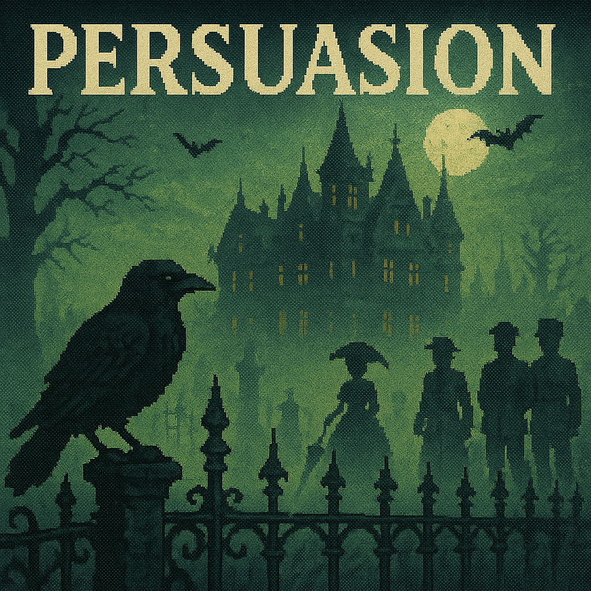
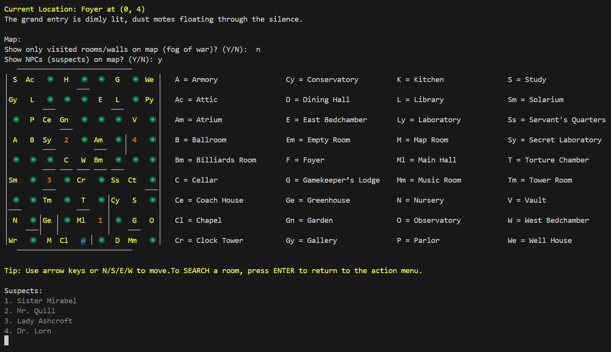

🕯️ 
## PERSUASION
 

A Deductive Text-Driven Victorian Roguelike Mystery

Step into the fog-drenched world of Persuasion, a haunting retro-inspired RPG where choices are dynamic, every shadow hides a secret, and every whispered lie could be your last clue.

---

🎩 Victorian Gothic Atmosphere

Set in the eerie halls of a decaying Victorian estate, Persuasion draws you into a labyrinth of candlelit corridors, locked attics, and crumbling cellars—each filled with cryptic objects, ritualistic clues, and unspeakable horrors. Lovecraftian madness blends with British restraint in this masterclass of moody mystery.

---

💀 Murder. Mystery. Madness.

Unravel a chilling murder plot by:

- 🔍 Investigating over two dozen uniquely described rooms, from the Parlor to the Torture Chamber.
- 🧠 Interrogating up to 8 suspects, each with their own alibis, motives, and behavioral traits.
- 📓 Tracking clues and suspicions through your interactive investigation journal.
- 🎭 Evaluating suspect credibility using a dynamic truth-detection system based on your perception, sanity, and growing reputation.
- 🩸 Engaging in deadly confrontations if the murderer strikes—or if you do.

For a full overview of the mystery, see the [Main Mystery Guide](MainMystery.md).

---

🕹️ Retro Mechanics, Modern Depth

With its nostalgic ASCII-style map, fully text-driven interface, and Choose-Your-Own-Adventure pacing, Persuasion pays tribute to the golden era of narrative games. But beneath the classic surface lies a modern engine featuring:

- 🗺️ Procedurally generated mansions—each run is different.
- 👁️ Fog-of-war navigation, blocked passages, and hidden paths.
- 📦 Inventory, stat-based character creation, and clue discovery.
- 🧍‍♂️ Dynamic NPC movement: suspects roam the mansion as you do, raising tension and uncertainty.
- 💬 Hybrid interrogation-combat system—ask the wrong questions, and you might bleed for it.
- ⏳ Turn-based progression ensures that your choices shape the story… and the map.

---

🧠 Replayable, Deep, and Immersive

No two playthroughs are alike. With over 120 potential room nodes, branching paths, stat-based combat, and randomized clue & suspect combinations, Persuasion invites repeat investigations. A full session can last 2–5 hours, or stretch longer for completionists and careful sleuths.

---

👁️‍🗨️ Low Magic. High Dread.

The world of Persuasion features subtle supernatural elements, rooted in psychological horror and spiritual dread. Sanity is your most fragile asset. As your mind fractures, room descriptions distort, text clarity declines, and even the map can lie.

---

📎  
## CORE FEATURES

**Unravel the Mystery with Dynamic Deduction!**

Every playthrough of Persuasion features a fully interactive deduction chart, letting you track suspects’ motives, means, alibis, relationships, and more. No two investigations are ever the same—each time you play, the culprit is randomly assigned new motives, secrets, and opportunities. Piece together clues, interrogate suspects, and watch your deduction tree grow as you uncover the tangled web of lies and hidden truths. With every motive, means, and alibi shuffled for each case, your path to justice is always fresh, challenging, and deeply rewarding.

Can you solve the mystery before the shadows claim you? The answer is always different!

- ✔️ Track solved mysteries, testamonies, clues and artifacts in your journal
- ✔️ 100% keyboard-controlled interface
- ✔️ ASCII map with location initials and movement trail
- ✔️ Stat-based skill checks for interrogation, combat and clue discovery
- ✔️ Inventory, quest log, and journal systems
- ✔️ Clue/evidence credibility ranking
- ✔️ A complete scoring and achievement system
- ✔️ Single save system
- ✔️ Procedural map generation and mansion layouts
- ✔️ Persuasion skill: Use your innate ability to influence suspects 
- ✔️ Combat and persuasion systems expanded with new transformation mechanics and chase minigame
- ✔️ Dynamic NPC movement: suspects roam the mansion, can chase or halt when colliding with player
- ✔️ Turn-based progression and optional fog-of-war navigation
- ✔️ Supernatural events, sanity effects, and stat-based text distortion
- ✔️ Multiple difficulty modes (Easy/Hard) affecting clues, suspect tolerance, and chase speed
- ✔️ Unique artifacts, potions, and clues scattered throughout the manor
- ✔️ Deduction tree and suspicion hints (toggleable in journal)
- ✔️ Stylish retro aesthetic and 8-bit inspired art (coming soon as DLC!)

---

🎮 A Game of Logic, Faith, and Perception

You're not just fighting monsters. You're fighting lies, misdirection, and your own unraveling mind. Persuasion challenges players to think like detectives, act like survivors, and persevere like heroes.

Can you see through the veil of fear, or will you be the next body found in the parlor?

---

#### 📦 Download
## RELEASE FILES

- [Download Persuasion48.zip](Persuasion48.zip)
- [Download Persuasion49untested.zip](Persuasion49untested.zip)

---

### 📖 Learn More
